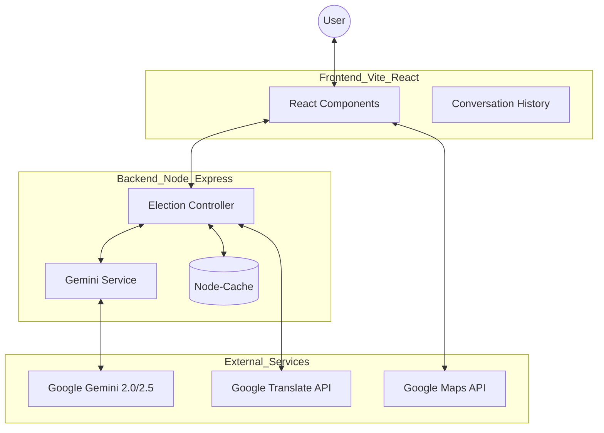

# 🗳️ EleEdu AI - Intelligent Election Assistant

> **Empowering Democracy through Artificial Intelligence.**


## 🌟 Demo Links
- **GitHub Repository**: [https://github.com/bajrangi-IT/ELEEDU-AI](https://github.com/bajrangi-IT/ELEEDU-AI)
- **Live Demo**: [Click here to deploy and view live](https://vercel.com/new/clone?repository-url=https%3A%2F%2Fgithub.com%2Fbajrangi-IT%2FELEEDU-AI)

## 🚀 Vision
EleEdu AI is a production-ready web application designed to bridge the gap between complex election processes and citizens. By leveraging **Google Gemini AI** and **Google Cloud Services**, we provide a seamless, accessible, and secure platform for voter education and engagement.

## 🏗️ System Architecture



## 🔐 Security & Defensive Practices
- **Strict CSP**: Hardened Content Security Policy to prevent XSS.
- **Rate Limiting**: Protects against DoS and brute-force attacks.
- **Environment Validation**: Fail-fast startup if API keys are missing.
- **Input Sanitization**: Joi-based validation for all incoming payloads.

## ♿ Accessibility (A11y)
- **WCAG 2.1 Compliant**: ARIA labels, semantic HTML, and high contrast.
- **Reduced Motion**: Respects OS-level motion preferences.
- **Keyboard Navigable**: Full support for screen readers and focus management.

## 🛠️ Technical Stack
- **Frontend**: React 19, Vite, Framer Motion (Animations), Lucide React (Icons).
- **Backend**: Node.js, Express 5.
- **AI**: Google Gemini 1.5 Flash.
- **Services**: Google Maps API, Firebase Admin.
- **Testing**: Jest, Supertest, Vitest.
- **Security**: Helmet, CORS, Rate Limiting, Input Validation.

## 🏗️ Architecture
The application follows a modular client-server architecture:
- **/client**: A modern React SPA with accessibility (A11y) at its core.
- **/server**: A secure Express API with integrated caching and Google Cloud services.
- **Middleware**: Custom logging, security headers, and rate limiting.

## 🎯 Challenge Alignment & Persona
- **Chosen Vertical**: Voter Education & Awareness
- **Persona Implementation**: The application acts as a high-fidelity, empathetic election tutor. 
- **Logical Decision Making**: Uses multi-model fallback logic (Gemini 2.0/2.5) to ensure consistent education delivery even during outages.
- **Google Services**: Meaningful integration of Gemini AI for conversational learning and Google Maps for physical booth location.

## 🔒 Security Measures
- **Rate Limiting**: Protection against brute-force and DoS attacks.
- **Input Sanitization**: Strict validation of user queries and eligibility data.
- **Secure Headers**: Implemented using Helmet CSP policies.
- **Environment Safety**: Zero exposure of sensitive keys via `.env` management.

## 🌍 Google Services Integration
- **Gemini AI**: Powers the Smart Assistant with context-aware election knowledge.
- **Google Maps**: Real-time polling booth discovery and navigation.
- **Cloud Translation**: Automatic translation for multi-language support.

---
© 2026 EleEdu AI Team. Licensed under ISC.
- **📍 Polling Booth Locator**: Integrated Google Maps for real-time location and navigation to the nearest voting centers.
- **🎙️ Voice-First Mode**: Full Speech-to-Text and Text-to-Speech support for maximum accessibility.
- **🌍 Multilingual Intelligence**: Real-time translation into regional languages using Google Translate.

## 🛠️ Technology Stack
- **Frontend**: React, Vite, Framer Motion, Lucide React, CSS Modules.
- **Backend**: Node.js, Express, Google Generative AI (Gemini), Helmet (Security).
- **Services**: Google Maps API, Google Translate API, Google Speech API, Firebase.

## 📁 Project Structure
- `/client`: Modern React frontend with a glassmorphism design system.
- `/server`: Node.js API with secure Google Service proxies.
- `/tests`: Comprehensive unit tests for both eligibility logic and frontend components.

## ⚙️ Installation & Setup
```bash
# Clone the repo
git clone https://github.com/bajrangi-IT/ELEEDU-AI.git

# Install dependencies
npm install

# Start development
npm run dev
```

---
Built by **Antigravity AI** for the **2026 AI Innovation Challenge**.
